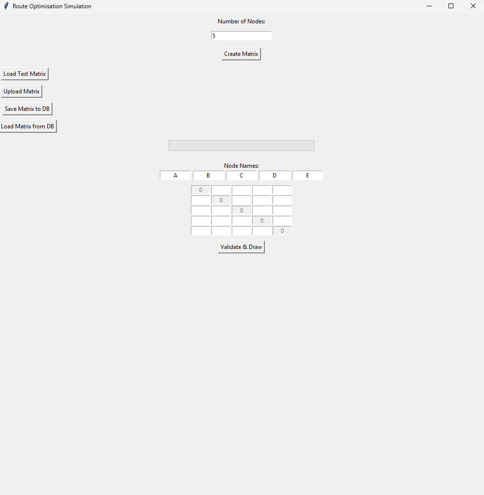
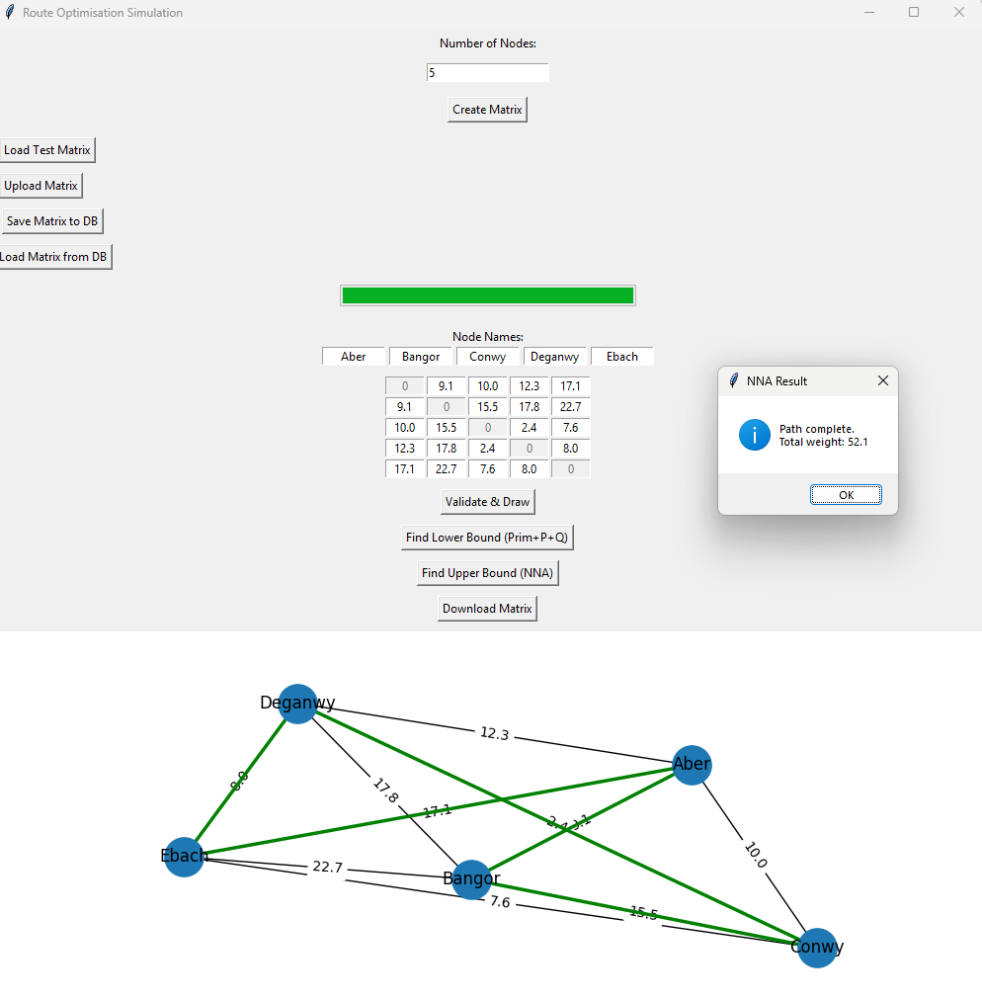
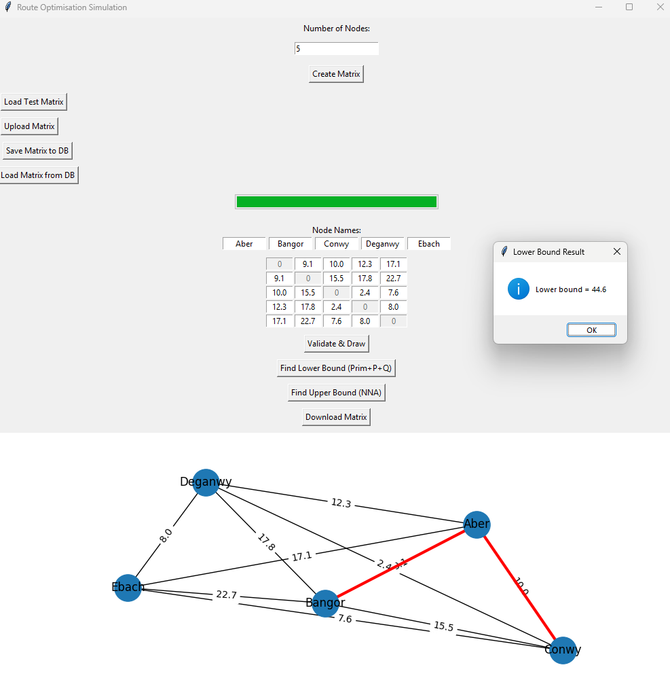

# Route Optimisation Visualiser

A Python desktop app that visualises Prim's Algorithm and Nearest Neighbour Heuristic step by step on a weighted graph to find the upper and lower bounds.

## Why I built this
Students often struggle to visualise how algorithms like Prim's and NNA work in practice. I ran stakeholder interviews and observations to confirm this, then built an interactive tool to animate both algorithms on live graphs; I used this in my AQA Computer Science NEA

## Tech Stack
- Python
- Tkinter (GUI)
- NetworkX (graph structure)
- Matplotlib (visualisation)
- SQLite (saving/loading matrices and results)

## How to run
1. Install dependencies `pip install networkx matplotlib`
2. Run: `route_optimisation_visualiser.py`

## Results
Used by my maths teacher in class - 90% of students reported improved understanding of the algorithms, and the project scored 84%, the highest in the cohort

## Screenshots

### Input matrix screen

### NNA result

### Lower bound 

